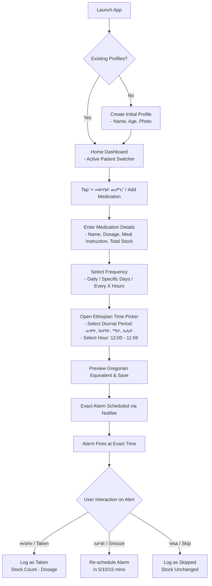

# Product Requirements Document (PRD)

**Project Name:** Ethiopian Local Time Medication Reminder App (የመድሃኒት ማስታወሻ)  
**Document Version:** 1.0.0  
**Status:** Approved for Development  
**Target Platforms:** Android & iOS (React Native)  
**Primary UI Language:** Amharic (አማርኛ) with English toggle  
**Codebase & Architecture:** TypeScript / English  

---

## 1. Executive Summary & Problem Statement

### 1.1 The Problem
In Ethiopia, everyday life, healthcare consultations, and domestic routines operate primarily on the **Ethiopian 12-hour cyclical time format**, where:
- The day starts at sunrise: **12:00 ጠዋት (06:00 AM Gregorian)**.
- Midday is **06:00 ከሰዓት (12:00 PM Gregorian)**.
- Evening begins at sunset: **12:00 ማታ (06:00 PM Gregorian)**.
- Midnight is **06:00 ሌሊት (12:00 AM Gregorian)**.

However, smartphones and standard operating systems (Android, iOS) calculate time in Gregorian UTC/24-hour formats. Existing reminder apps force users to mentally translate Ethiopian time into Gregorian time (e.g., converting "2:00 ጠዋት" into "8:00 AM"). For elderly patients, non-English speakers, and busy caregivers managing multiple family members, this cognitive friction causes:
1. **Dosing errors & missed doses** (e.g., confusing 2:00 AM with 2:00 ጠዋት).
2. **Poor adherence for chronic therapies** (hypertension, diabetes, HIV/TB).
3. **High caregiver burden** due to manual tracking across family members.

### 1.2 The Solution
A lightweight, offline-first mobile application tailored for the Ethiopian community. It features a native Ethiopian time picker and conversion engine, multi-dependent profile support, loud battery-resilient alarms, and Amharic-first audio/text notifications.

---

## 2. Target Audience & User Personas

| Persona | Demographics & Context | Core Pain Points | Key Needs |
|---|---|---|---|
| **Persona A: Almaz (The Caregiver)** | Age 38, Addis Ababa. Manages household and coordinates medication for her diabetic mother and asthmatic son. | Forgets who took what; gets confused when setting reminders using Gregorian standard pickers. | Multi-patient profiles, personalized Amharic alarm voice/text, simple stock depletion tracking. |
| **Persona B: Ato Kebede (The Chronic Patient)** | Age 62, Hawassa. Takes daily blood pressure medication twice a day. Phone language is set to Amharic. | Struggles with complex interfaces; easily dismisses silent push notifications; phone is often on battery saver. | High-volume alarm that sounds even on mute/Doze mode, intuitive 12-hour Ethiopian time picker (ጠዋት/ማታ). |
| **Persona C: Dr. Dawit (The Healthcare Worker)** | Age 29, Health Center Nurse. Advises discharged patients on prescription regimens. | Patients consistently confuse intake intervals (e.g. "every 8 hours" vs clock times). | Simple schedule setup tool he can configure on the patient's phone before hospital discharge. |

---

## 3. Core Features & Functional Requirements

### 3.1 Profile & Dependent Management
- **Multi-Profile Support:** Add, edit, and delete multiple patient profiles (e.g., *እኔ / Self*, *እናት / Mother*, *ልጅ / Child*) under a single installation.
- **Profile Details:** Name, avatar/color tag, age, notes (allergies/conditions), and emergency contact number.
- **Active Filter:** Top app-bar allows instant filtering of dashboard schedules and history by individual profile or "All".

### 3.2 Medication Scheduling & Ethiopian Time Converter
- **Medication Metadata:**
  - Medication name & dosage (e.g., 1 tablet, 5ml, 2 drops).
  - Timing relation to food: *ከምግብ በፊት* (Before meal), *ከምግብ በኋላ* (After meal), *ከምግብ ጋር* (With meal).
  - Current stock count and low-stock threshold.
- **Native Ethiopian Diurnal Time Picker:**
  - Custom UI picker organized into the four distinct cultural time segments:
    - **ጠዋት (Morning):** 12:00 to 05:59 (Gregorian 06:00 to 11:59)
    - **ከሰዓት (Afternoon):** 06:00 to 11:59 (Gregorian 12:00 to 17:59)
    - **ማታ (Evening):** 12:00 to 05:59 (Gregorian 18:00 to 23:59)
    - **ሌሊት (Night):** 06:00 to 11:59 (Gregorian 00:00 to 05:59)
- **Time Conversion Engine:**
  - Map Ethiopian Local Time $(H_{eth}, M, Period)$ into Gregorian System Time $(H_{greg}, M)$:
    $$\text{Gregorian Hour (24h format)} = (H_{eth} + \text{PeriodOffset}) \pmod{24}$$
    where:
    - ጠዋት (Morning): $Offset = 6$ (e.g., 12:00 ጠዋት $\rightarrow$ 06:00)
    - ከሰዓት (Afternoon): $Offset = 6$ (e.g., 6:00 ከሰዓት $\rightarrow$ 12:00)
    - ማታ (Evening): $Offset = 18$ (e.g., 12:00 ማታ $\rightarrow$ 18:00)
    - ሌሊት (Night): $Offset = 18$ (e.g., 6:00 ሌሊት $\rightarrow$ 00:00)
  - Time is stored internally as standard UTC epoch timestamps for deterministic hardware alarms.
- **Recurrence Patterns:**
  - Daily (specific times per day).
  - Day-of-week intervals (e.g., Monday, Wednesday, Friday).
  - Cycle intervals (e.g., Every 8 hours, Every 12 hours).

### 3.3 High-Priority Alert & Notification Engine
- **Alarm Execution:**
  - Uses exact Android `AlarmManager` (`SCHEDULE_EXACT_ALARM` / `USE_EXACT_ALARM`) and iOS critical alerts or local notifications.
  - Rings even in **Doze Mode**, Battery Saver, and when the screen is locked.
  - Plays dedicated audible chime and distinctive vibration pattern.
- **Personalized Notification Copy (Amharic):**
  - Notification header & body clearly identifies the dependent:
    > *"ያሬድ፣ የደም ግፊት መድሃኒት (1 ኪኒን - ከምግብ በኋላ) መውሰጃ ሰዓት ደርሷል!"*
- **Actionable Notification Controls:**
  1. **ወሰድኩ (Taken):** Logs dose as completed; automatically decrements medication stock inventory.
  2. **አዘግይ (Snooze):** Reschedules an exact alarm after 5, 10, or 15 minutes (user configurable).
  3. **ዝለል (Skip):** Flags dose as skipped; prompts for optional reason (e.g., side effects, feeling unwell); does not decrement stock.

### 3.4 History, Adherence & Inventory Tracking
- **Adherence Dashboard:**
  - Daily/Weekly timeline of scheduled doses displaying status badges: *Taken (አረንጓዴ/Green)*, *Skipped (ቢጫ/Yellow)*, *Missed (ቀይ/Red)*.
  - Overall Adherence Rate percentage per profile.
- **Stock Depletion Forecasting:**
  - Automated warning push when stock drops below $\le 3$ days of remaining doses.
  - One-tap "Refill Stock" button with custom package/pill quantity counter.

---

## 4. Technical Architecture & Non-Functional Requirements

### 4.1 Tech Stack

| Layer | Selection | Justification |
|---|---|---|
| **Framework** | React Native (bare / Expo Prebuild) | Direct access to native modules and hardware alarm services. |
| **Language** | TypeScript | Strong typing for time conversions, diurnal enums, and database entities. |
| **Notification Engine** | `@notifee/react-native` | Production-grade support for Android Exact Alarms, Notification Channels, Full-Screen Intents, and Action Handlers. |
| **Local Database** | SQLite via `react-native-quick-sqlite` or `WatermelonDB` | True offline-first relational structure (Profiles $\leftrightarrow$ Medications $\leftrightarrow$ Logs). |
| **Key-Value Storage** | `react-native-mmkv` | Instant read/write for user preferences and active profile selection. |
| **State Management** | Zustand | Lightweight, un-opinionated state for UI filtering and active session. |

### 4.2 Non-Functional Requirements (NFRs)
1. **Offline Capability:** 100% of scheduling, time conversion, alarm triggering, and logging must function with zero network access.
2. **Reboot Resilience:** Must implement Android `BOOT_COMPLETED` broadcast receiver to re-register pending exact alarms upon device restart.
3. **Alarm Latency:** Alarms must fire within $\pm 15$ seconds of the target scheduled time.
4. **Localization (l10n):** UI localized in Amharic (አማርኛ) and English, supporting Ethiopic Ge'ez typography and numerals where requested.
5. **Battery Efficiency:** Minimal background overhead; relies strictly on OS AlarmManager rather than background polling services.

---

## 5. End-to-End User Flow

### Flow Breakdown:
1. **Onboarding:** First-time user launches the app, selects language (Amharic default), and enters the primary profile name (e.g., "ያሬድ" or "እማማ").
2. **Adding Schedule:**
   - User taps "+" button.
   - Enters medication name (e.g., "ሜትፎርሚን" / Metformin), dosage (1 ኪኒን), and meal instruction ("ከምግብ በኋላ").
   - Picks time using the Ethiopian Dial: selects **ጠዋት** and **02:00** (equivalent to 08:00 AM).
   - Enters initial inventory (e.g., 30 pills).
   - System displays confirmation: *"በየቀኑ ጠዋት 2:00 (8:00 AM) ይሰራል"*.
3. **Alert Event:**
   - Phone screen illuminates with full-screen notification in Amharic.
   - User taps "ወሰድኩ" (Taken).
   - Stock decrements from 30 to 29; dashboard log turns green.

---

## 6. Success Metrics & Key Performance Indicators (KPIs)

| Metric Category | KPI | Target Benchmark |
|---|---|---|
| **Adherence Efficacy** | Average Patient Adherence Rate | $\ge 85\%$ of scheduled doses marked as "Taken". |
| **Alarm Reliability** | Alarm Trigger Success Rate | $\ge 99.5\%$ of scheduled alarms fired within 30 seconds of target time. |
| **System Resilience** | Reboot Recovery Rate | $100\%$ of active alarms restored after OS reboot. |
| **User Engagement** | Daily Active Users / Monthly Active Users (DAU/MAU) | $\ge 60\%$ (indicative of daily routine utility). |
| **Inventory Preventative Care** | Refill Timeliness | $\ge 70\%$ of users refill before reaching zero stock. |

---

## 7. Product Roadmap & Release Phases

### Phase 1: MVP (Core Adherence & Time Engine) - Target: Weeks 1–4
- [x] Project architecture setup (React Native + TypeScript + MMKV + SQLite).
- [ ] Bi-directional Ethiopian $\leftrightarrow$ Gregorian conversion engine with unit tests.
- [ ] Custom Ethiopian Time Picker component (ጠዋት, ከሰዓት, ማታ, ሌሊት).
- [ ] Single profile + Medication CRUD (Name, Dosage, Time).
- [ ] `@notifee/react-native` exact alarm integration with Android boot receiver.
- [ ] Basic Actionable notifications (ወሰድኩ / አዘግይ / ዝለል).

### Phase 2: Caregiver & Stock Management (v1.1) - Target: Weeks 5–7
- [ ] Multi-dependent profile management with color coding & photo upload.
- [ ] Profile-specific dashboard filtering.
- [ ] Inventory depletion tracking and $\le 3$ days low-stock notifications.
- [ ] Intake history calendar & basic adherence percentage report.
- [ ] Full Amharic / English toggle with persistent locale preference.

### Phase 3: Advanced Accessibility & Intelligence (v2.0) - Target: Weeks 8–12
- [ ] **Amharic Voice Alarms:** Audio prompts speaking the dose instruction (e.g., recorded or offline TTS for elderly patients).
- [ ] **SMS Caregiver Alerts:** Automatic SMS to caregiver if a high-risk medication is skipped or unacknowledged for > 30 minutes.
- [ ] **PDF Export:** Export adherence and dosage reports for doctor visits.
- [ ] **Oromiffa & Tigrinya Localization:** Expand to major regional Ethiopian languages.
